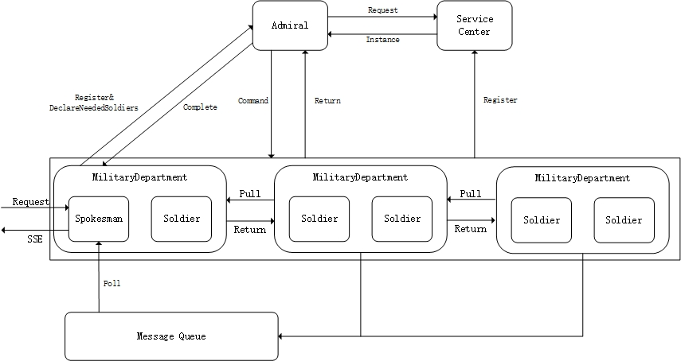

# Admiral: SSE & Event Driven Multi-Agent coordinator framework - developing version. 
Although this project is concerning multi-agent, but you can also use it in a
microservice platform if you need to output intermediate result.

## Architecture of Admiral



## Quick start

**Declare enter class compatible with spring MVC.**

```java
@Spokesman
public class LandForceSpokesman {

    @GetMapping("announce/{name}")
    public String landForceSpokesman(@PathVariable String name, @RequestParam int age) {
        return "I'am land force spokesman, my name is " + name + " and age is " + age;
    }

    @GetMapping("answer")
    @Produce(name= "answer")
    public String answer(){
        return "I have answer your question";
    }
}
```

`@Spokesman` is an annotation similar to `@Controller` in spring, but it will be managed
by Admiral framework. Same with spring mvc, you can use view annotation `@GetMapping`,
`PostMapping`, etc. and parameter annotation `@PathVariable` etc. to announce a view function.

However, this framework is an event driven framework, so you also need to state what event will
the view function will produce using `@Produce` annotation. If you do not use it, the default 
produce event will be the full qualified class name of the class concat with method name.

**Declare Modules using event driven mode.**

```java
@Barrack
public class ArtilleryBarrack {

    @Soldier(subscribes = "io.github.admiral.soldier.LandForceSpokesman$landForceSpokesman",
    produce = "artilleryForward")
    public String forward(){
        return "artilleryBarrack";
    }

    @Soldier(subscribes = "io.github.admiral.soldier.LandForceSpokesman$landForceSpokesman",
            produce = "artilleryBomb")
    public String bomb(){
        return "Bomb!";
    }
}
```

You can use `@Barrack` annotation to declare a class that contains `@Soldier` functions.
`@Soldier` annotation contains parameter `subscribes` to declare events that should consume.
It can also be a list of event names. `produce` element declare what event it will produce.